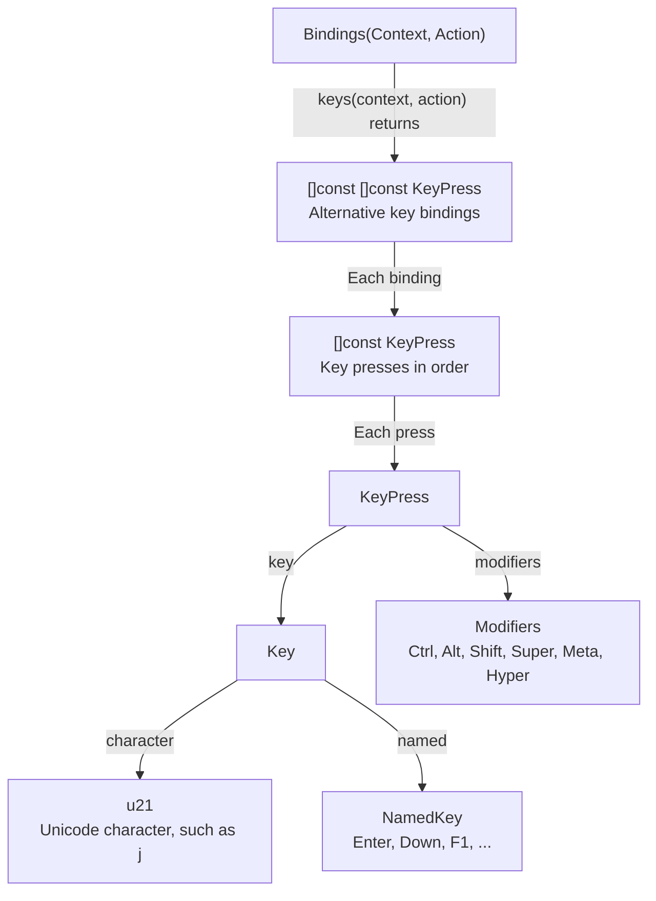
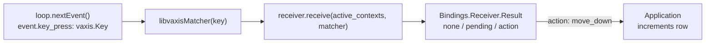

# zig-keymap

[](https://ziglang.org)
[](LICENSE)
[](https://github.com/hashiiiii/zig-keymap/releases)
[](https://github.com/hashiiiii/zig-keymap/actions/workflows/ci.yml)

zig-keymap maps keys to actions in Zig terminal applications.  
Applications define defaults in Zig, and users can change them with JSON configuration.  
It resolves `Mod` for a chosen platform, provides key labels for display, and matches successive key presses such as `g g`.

## Installation

zig-keymap requires Zig `0.16.0` and has no external dependencies.

Add `zig_keymap` to `build.zig.zon`:

   ```sh
   zig fetch --save=zig_keymap "git+https://github.com/hashiiiii/zig-keymap#v0.2.0"
   ```

In `build.zig`, import the `keymap` module:

   ```zig
   const keymap = b.dependency("zig_keymap", .{
       .target = target,
       .optimize = optimize,
   });
   app.root_module.addImport("keymap", keymap.module("keymap"));
   ```

## Types

`KeyPress` describes one key and its modifiers in a configured binding.
The arrows below label return values, list elements, and fields.
`Key` holds either a Unicode character or a `NamedKey`.



For `["Down", "j", "g g"]`, the outer list has three bindings; the last binding contains two `KeyPress` values.

`Bindings(Context, Action)` creates a type using the application's two enums.
Names such as `Bindings.Default` refer to types declared inside it:

```text
Bindings(Context, Action)
├── Default        context, action, and default key strings
├── Definition     defaults and context_groups
├── LoadOptions    Platform for Mod; ModifierName for labels
├── LoadResult     bindings or Diagnostic
└── Receiver       matching state for one input stream
    ├── Options    timeout settings
    └── Result     none, pending, or action

Diagnostic
└── Kind           syntax, invalid_key, collision, ...
```

`Platform` resolves `Mod` to a concrete modifier.
`ModifierName` selects modifier spelling in labels.

## Usage

Each key binding assigns one or more `KeyPress` values to an action in a context.
This example uses [libvaxis](https://github.com/rockorager/libvaxis) to read keyboard input and prints a row counter.
When `Ctrl+n` is pressed while the `list` context is active:



`vaxis.Key` is the received input; `keymap.KeyPress` describes the configured input to match.
The matcher compares them using libvaxis's `Key.matches`.

In the JSON below, `Ctrl+n` replaces the default `Down` and `j` bindings for `move_down`.
The row movement code stays the same.
Import both `keymap` and `vaxis` in the application.
Save the JSON example below as `keymap.json` before running the application.

```zig
const std = @import("std");
const keymap = @import("keymap");
const vaxis = @import("vaxis");
const Context = enum { global, list };
const Action = enum { quit, move_down, top };
const Bindings = keymap.Bindings(Context, Action);

// Only key presses matter here because this example has no screen to resize.
const Event = union(enum) { key_press: vaxis.Key };

// Enum values let the compiler reject unknown contexts and actions in these defaults.
const definition: Bindings.Definition = .{
    .defaults = &.{
        .{ .context = .global, .action = .quit, .keys = &.{ "q", "Mod+q" } },
        .{ .context = .list, .action = .move_down, .keys = &.{ "Down", "j" } },
        .{ .context = .list, .action = .top, .keys = &.{"g g"} },
    },
    // Groups declare possible overlaps for conflict checks.
    // Receive selects the active contexts.
    // With these defaults, assigning q to list.move_down would collide with global.quit.
    .context_groups = &.{
        &.{ .global, .list },
    },
};

pub fn main(init: std.process.Init) !void {
    const allocator = init.gpa;
    const io = init.io;

    // A missing or unreadable file must stop startup because JSON configuration is required.
    const keymap_json = try std.Io.Dir.cwd().readFileAlloc(io, "keymap.json", allocator, .unlimited);
    defer allocator.free(keymap_json);

    // Mod follows the keyboard's platform, which may differ from the build target.
    var bindings = switch (try Bindings.loadWithOptions(allocator, definition, keymap_json, .{
        .platform = .macos,
        // Label spelling can follow the client without changing which input matches.
        .modifier_name = .macos,
    })) {
        .bindings => |value| value,
        .invalid => |diagnostic| {
            std.log.err("{s}", .{diagnostic.message()});
            return error.InvalidKeymap;
        },
    };
    defer bindings.deinit();

    // Keep one receiver per input stream so partial sequences stay separate.
    var receiver = try bindings.receiver(allocator, io, .{});
    defer receiver.deinit();

    var tty_buffer: [1024]u8 = undefined;
    var tty = try vaxis.Tty.init(io, &tty_buffer);
    defer tty.deinit();

    var vx = try vaxis.init(io, allocator, init.environ_map, .{});
    defer vx.deinit(allocator, tty.writer());

    var loop: vaxis.Loop(Event) = .init(io, &tty, &vx);

    // Start native input parsing so nextEvent() returns real keyboard events.
    try loop.start();
    defer loop.stop();

    // Loaded labels keep the quit hint consistent with JSON changes.
    std.debug.print("Quit: {s}\r\n", .{bindings.hint(.global, .quit)});

    // Passing both contexts keeps global quit available while list navigation is active.
    const active_contexts: []const Context = &.{ .global, .list };
    var row: usize = 0;
    while (true) {
        const event = try loop.nextEvent();
        const key = event.key_press;

        // Delegating to Key.matches preserves libvaxis's text and Shift matching rules.
        switch (receiver.receive(active_contexts, keymap.libvaxisMatcher(key))) {
            // The receiver chooses an action; the application owns its behavior.
            .action => |action| switch (action) {
                .quit => return,
                .move_down => row +|= 1,
                .top => row = 0,
            },
            // A partial "g g" must wait; unassigned input has no action to run.
            .pending, .none => continue,
        }
        std.debug.print("Row: {d}\r\n", .{row});
    }
}
```

Save this configuration as `keymap.json`:

```json
{
  "global": { "quit": ["Ctrl+q"] },
  "list": {
    "move_down": ["Ctrl+n"]
  }
}
```

An action in JSON replaces all its default key bindings.
An empty array removes its bindings. An omitted action keeps its defaults.
Here, `top` is omitted, so `g g` remains available.

## Development

```sh
mise install
zig fmt build.zig build.zig.zon src e2e
zig build test -Doptimize=Debug
zig build test -Doptimize=ReleaseSafe
```

```text
src/
├── root.zig         public API and usage example
├── bindings.zig     configuration, action bindings, and labels
├── key.zig          key types, parsing, formatting, and equivalence
├── keys.zig         key string splitting and list overlap checks
├── receiver.zig     input matching and pending state
├── validation.zig   default validation and context overlap checks
└── matcher/
    └── libvaxis.zig  libvaxis key comparison
```

## API documentation

Read the [API documentation](https://zig-keymap.hashiiiii.workers.dev).

Run `zig build docs` to generate it in `zig-out/docs`.  
The Docs workflow publishes it to Cloudflare Workers when `main` changes.

## License

[Apache License 2.0](LICENSE)
